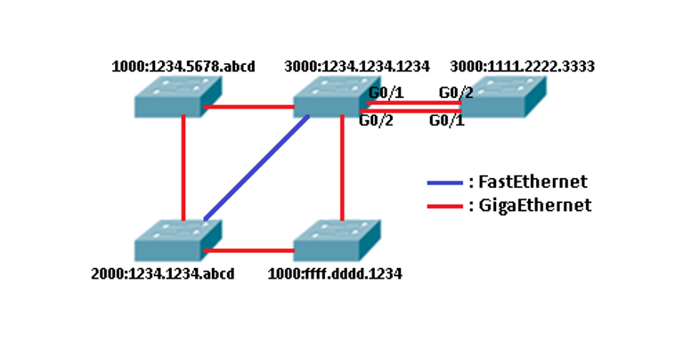
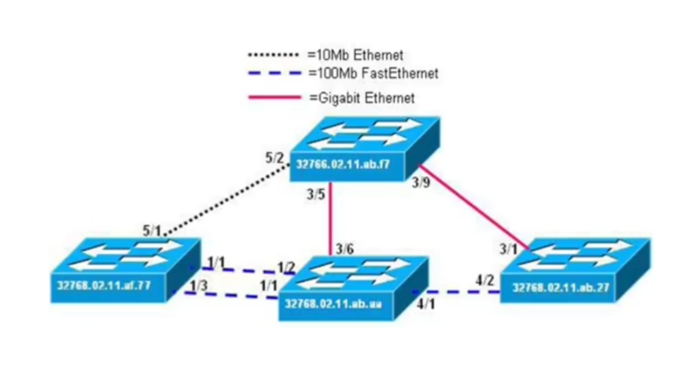

# Network_lab1
Il s'agit du premier laboratoire du cours de réseaux et systèmes informatique.

Pour ce premier labo nous avons du nous interesser au protocole STP (Spanning-Tree-Protocol), ce protocole permet d'éviter les boucles dans une topologie de commutateurs Ethernet. Il est défini par la norme IEEE 802.1D et est essentiel pour garantir un réseau stable et sans congestion.


Dans un réseau avec plusieurs switchs interconnectés, une redondance est souvent mise en place pour éviter une panne en cas de défaillance d'un lien. Cependant, cette redondance peut créer des boucles de commutation, entraînant : 
  * Des tempêtes de broadcast (les trames circulent en boucle infiniment)
  * Une saturation du réseau (les switchs deviennent inutilisables)
  * Une duplication des paquets (perturbant la communication des équipements)

Le STP permet d’éliminer ces boucles en désactivant temporairement certains liens redondants.

Le but de ce laboratoire est d'analyser le protocole STP, d'effectuer les opération du protocole à la main et ensuite de comparer ce que nous avons obtenu avec une simulation sur Cisco Packet Tracer

# Fonctionnement de STP

### 1- On trouve le switch root graçe à l'identité (Numéro de priorité qui par défaut est à 32768 + Adresse MAC)
Le root sera celui qui possède l'identitée la plus petite

### 2- On doit ensuite trouver le root Port
Le root port on le trouve en calculant pour chaque interface (port) quel est le chemin qu'il effectue avant d'arriver au switch root en en calculant le cout cumulé (si le cout cumulé est le meme pour deux chemins differents alors on regarde le numéro d'identification des ports voisins (exemple: Fa0/1 > Fa0/0) et on prends celui qui a le plus petit numéro d'identification (on doit définir un RP pour chaque switch)

### 3- On doit trouver le Port designé pour chaque segment
Dans un segment ou il y a le port d'une switch root alors le port de la switch root est d'office un port designé, si c'est des ports normaux alors on se place au milieu du segment (Attention on ne compte pas le segments sur lequel on est placé) et on regarde vers quel port lechein est le plus court vers le switch root (à nouveau si deux chemins sont les memes alors on regarde l'addresse MAC et on prends la plus petite)

### 4- Identification des ports en Forwarding et Block

Tous les ports roots ainsi que les ports designés sont en Forwarding les ports restants sont en Block et donc si sur un segment les 2 ports sont en forwarding alors la communication se fait sans soucis mais si jamais sur un segment on a un port en block et le 2e en Forwarding alors ce segement est "coupé" artificiellement.

#### Exercices de la séance de laboratoire
Le but est d'utiliser le protocole STP à lamain, voir ce que l'on obtient et le comparer avec la simulation sur cisco packet tracer



et voici le deuxième exercice


En vert il y a tous les ports en Forwarding et en orange c'est tous les ports "bloqués" par le protocol STP donc si sur un segment il y a du vert et de l'orange alors le segment est artificiellement coupé, donc celà implique qu'aucune donnée ne passera par là.


#### Solution Cisco Packet Tracer

Si tout se passe bien voici à quoi votre "architecture devrait ressembler:


Mettre en place **STP (Spanning Tree Protocol)** sur Cisco permet d’éviter les **boucles réseau** lorsqu’il y a des connexions redondantes entre les switches.

---

## 🧠 Rappel rapide :

* STP est **activé par défaut** sur la plupart des switches Cisco.
* Il **désactive automatiquement les ports redondants** pour éviter les boucles.
* Il élit un **Root Bridge** (switch de référence) basé sur le **Bridge ID (priorité + MAC)**.

---

## ✅ ÉTAPES POUR METTRE EN PLACE STP SUR CISCO

### 🎯 Objectif : définir un switch comme **Root Bridge**, voir l’état des ports STP, et assurer la redondance sans boucle.

---

### 🔹 1. **Vérifier que STP est actif**

Sur **chaque switch** :

```bash
show spanning-tree
```

Tu verras :

* Le VLAN
* Le rôle de chaque port (Root, Designated, Blocking)
* Le Root Bridge

---

### 🔹 2. **Définir manuellement un Root Bridge (important)**

Sur le **switch que tu veux comme Root**, utilise une **priorité plus basse** :

```bash
configure terminal
spanning-tree vlan 1 priority 4096
exit
```

> Par défaut, la priorité est `32768`. Plus elle est basse, plus le switch a de chances d’être élu root.

---

### 🔹 3. (Optionnel) Configurer les autres switches avec une priorité plus haute

```bash
configure terminal
spanning-tree vlan 1 priority 32768
exit
```

---

### 🔹 4. **Voir l’état du STP après configuration**

```bash
show spanning-tree
```

* Tu verras si le switch est devenu **Root Bridge**
* Tu verras quel port est en **Blocking** pour couper la boucle

---

### 🔹 5. (Optionnel) Configurer **PortFast** sur les ports vers les PC (pour éviter les délais STP)

```bash
interface range fa0/1 - 24
spanning-tree portfast
exit
```

> ⚠️ Ne jamais activer **PortFast** sur des liens entre switches.

---

### 🔹 6. Sauvegarder la configuration

```bash
write memory
```

---

## 🔁 TOPOLOGIE TYPIQUE AVEC REDONDANCE

```
     [SW1]
     /   \
 [SW2]---[SW3]

→ SW1 élu Root Bridge  
→ STP bloque un lien pour éviter boucle  
→ Si un lien tombe, STP réactive un autre automatiquement.
```

---

Souhaites-tu un exemple de configuration complet pour 3 switches avec redondance STP ?

# Les Améliorations de STP

1- RSTP (Rapid Spanning Tree Protocol - IEEE 802.1w) : Version plus rapide qui réduit le temps de convergence.
2- MSTP (Multiple Spanning Tree Protocol - IEEE 802.1s) : Permet de gérer plusieurs VLANs sur un même réseau STP.
3- PVST+ (Per VLAN Spanning Tree Plus - Cisco) : Implémentation de Cisco qui permet d’avoir un STP distinct par VLAN.
