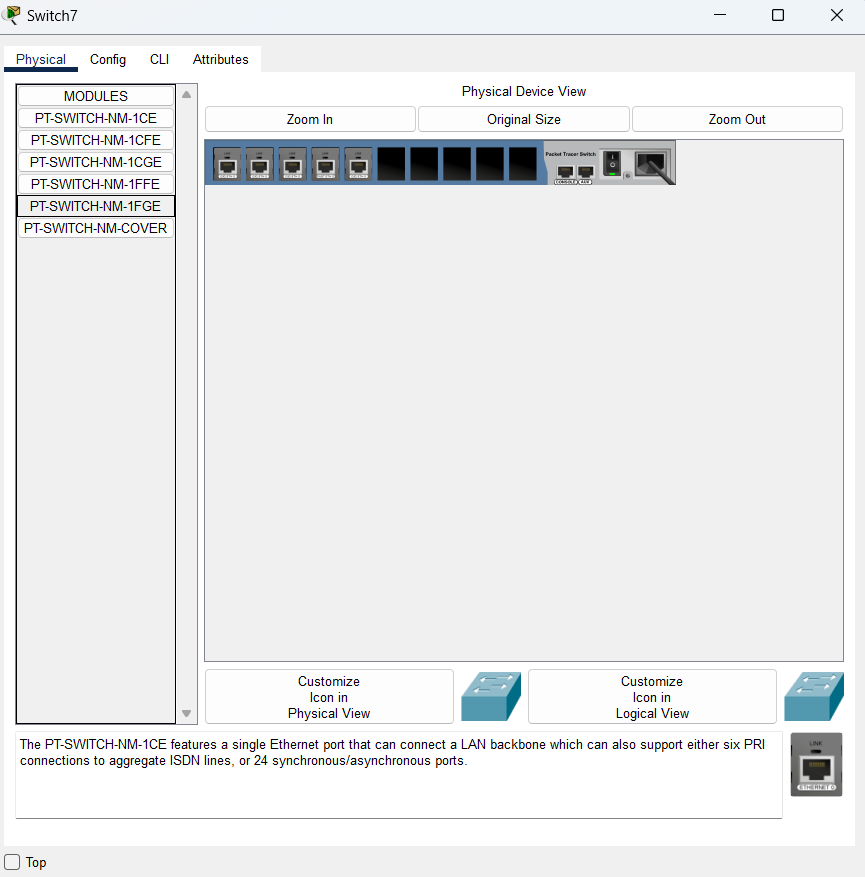

# Solution du Labo_1 :

Essayez d'effectuer le laboratoire et si jamais après avoir buté dessus durant pas mal de temps vous êtes bloqués alors venez checker la correction.

1 - Sur Cisco Packet Tracer mettez d'abord en place l'architecture en sélectionnant les switchs PT-Empty
2 - Vous allez ensuite cliquer sur la switch et vous tomberez sur une page dans ce style

3 - On arrete le switch via le petit boutton ON/OFF
4 - On ajoute les ports que nous voulons ajouter (CFE pour fastethernet et CGE pour gigabitethernet)
5 - On allume le switch
6 - On mets en place l'architecture de l'exercice (en mettant en pratique le protocole STP, faites gaffe aux switch que vous mettez en fonction des addresses MAC, etc)
7 - 

# Quelques commandes intéressantes

1 - Afficher l'adresse MAC du switch lui-même (Cette commande affiche l’adresse MAC du switch, souvent appelée Base Ethernet MAC Address) => **show version**
2 - Afficher la table des adresses MAC apprises par le switch => **show mac address-table**
  * Variante pour voir les adresses MAC dynamiques uniquement => **show mac address-table dynamic**
  *  Filtrer par un port spécifique => **show mac address-table interface fastEthernet 0/1**
3 - Vérifier l'adresse MAC d'une interface spécifique du switch => **show interfaces fastEthernet 0/1**

